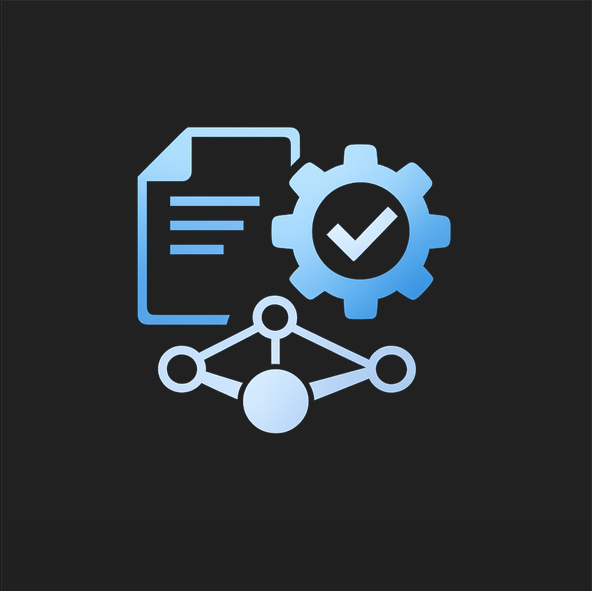

<p align="center">
  
</p>

<h1 align="center">DocForge Local</h1>

<p align="center">
  Local-first repository documentation with grounded claim→evidence alignment
</p>

<p align="center">
  <a href="https://pypi.org/project/docforge-local/">
    
  </a>
  <a href="https://deepwiki.com/center4aai/docforge-local">
    
  </a>
</p>

**DocForge Local** (`docforge-local`) generates repository documentation from real implementation evidence, writes Markdown artifacts, and publishes a local MkDocs Material site.

It is local-first and deterministic by default, so the primary workflow works without LLM credentials.

## What DocForge Local does

DocForge Local:

- scans a local repository;
- extracts implementation-grounded facts;
- generates documentation pages in Markdown;
- builds a browsable local site;
- optionally runs LLM-assisted generation when explicitly enabled.

## What works today

Stable user-facing workflows:

- `doctor`
- `generate-docs`
- `update-docs`
- `config`

Stable generated page surface includes:

- `project_snapshot`
- `overview`
- `architecture`
- `code_structure`
- `runtime_entrypoints`
- `reference_alignment`
- `agent_instruction_alignment`
- `readme_claim_alignment`

## Fast start

Install from PyPI:

```bash
uv tool install docforge-local
```

Or run from source:

```bash
uv sync
uv run docforge-local --help
```

Generate docs in deterministic mode (default):

```bash
docforge-local generate-docs --project-root /path/to/repo
```

## Primary workflows

### `doctor`

Check environment, paths, and optional reference/LLM readiness.

```bash
docforge-local doctor --project-root /path/to/repo
docforge-local doctor --project-root /path/to/repo --privacy
```

### `generate-docs`

Run end-to-end generation and local site publishing.

```bash
docforge-local generate-docs --project-root /path/to/repo
```

### `update-docs`

Run the update workflow against an existing documentation set.

```bash
docforge-local update-docs --project-root /path/to/repo
```

### `config`

Interactive configuration management (line-oriented terminal UX).

```bash
docforge-local config --project-root /path/to/repo
```

Useful helpers:

```bash
docforge-local config --project-root /path/to/repo --show-effective
docforge-local config --project-root /path/to/repo --show-sources
docforge-local config --project-root /path/to/repo --validate
```

## LLM mode (optional)

LLM mode is opt-in and requires valid OpenAI-compatible settings.

```bash
export REPO_AUTODOCS_ENABLE_LLM=true
export REPO_AUTODOCS_MODEL_NAME=gpt-4.1-mini
export REPO_AUTODOCS_BASE_URL=https://api.openai.com/v1

# optional when your endpoint requires auth
export REPO_AUTODOCS_API_KEY_ENV_VAR=OPENAI_API_KEY
export OPENAI_API_KEY=your_api_key_here

docforge-local generate-docs --project-root /path/to/repo --use-llm
```

Reliability note: LLM calls use a streaming-first transport. Retries only happen before meaningful streamed output starts. If a stream is interrupted after meaningful output begins, that section fails instead of auto-resending the same prompt.

## Configuration basics

Precedence:

**CLI overrides > environment variables > project config > user config > defaults**

Common config files:

- project config: `<project_root>/docforge.toml`
- user config: platform-specific user config path (override with `REPO_AUTODOCS_USER_CONFIG_FILE`)

Secrets:

- `api_key_mode=env`: read key from environment variable;
- `api_key_mode=keyring`: set/delete key through keyring-backed flows.

## External references and routed alignment

DocForge Local keeps **implementation analysis** and **external-reference analysis** separate.

For implementation evidence, DocForge-owned/tool-owned artifacts are excluded by default, including:

- `docforge.toml`
- `.docforge-local/`
- configured docs/output/site paths when those paths are inside the target repository

This keeps implementation conclusions grounded in project implementation sources rather than DocForge runtime artifacts.

External references can be supplied explicitly (`--reference-path`, repeatable) and/or discovered through configured defaults.

Routed alignment pages are separate by intent:

- `reference_alignment` — general references
- `agent_instruction_alignment` — AI-agent instruction files
- `readme_claim_alignment` — README claims

## Generated outputs

Default output locations:

- docs root: `<project_root>/.docforge-local/docs/`
- generated pages: `<project_root>/.docforge-local/docs/generated/`
- built site: `<project_root>/.docforge-local/site/`

Markdown artifacts are the source of truth, with MkDocs Material used for local HTML publishing.

## Diagnostics and debug artifacts

Generated section pages can include a **Structured Output Diagnostics** section when normalization/recovery logic had to intervene.

- a compact summary is shown first;
- detailed events are available in a collapsible `<details>` block;
- this is a transparency/debug aid and does not automatically mean generation failed.

Debug artifacts remain opt-in:

```bash
docforge-local generate-docs --project-root /path/to/repo --debug-artifacts
docforge-local update-docs --project-root /path/to/repo --debug-artifacts
```

## Limits and important notes

- Python 3.12+ is required.
- `uv` is the supported dependency/environment manager.
- Deterministic generation is the default baseline.
- LLM mode is optional and explicit.
- Keyring availability depends on host OS/runtime backend support.
